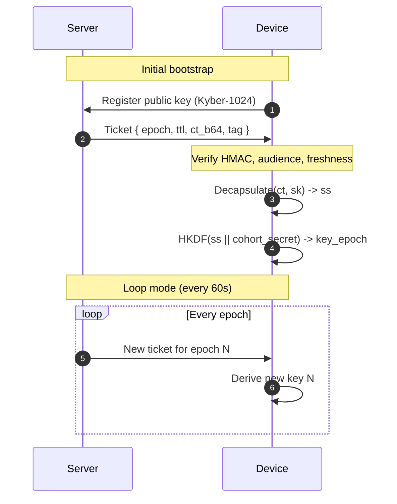

# Entropy KEM demo

A tiny lab prototype that bootstraps a symmetric key from a server to one or more devices using post-quantum Kyber-1024, then keeps rotating keys with a symmetric ratchet. The server never learns the final working keys.

**DISCLAIMER**: This was almost exclusively coded by an LLM based on inputs from a human with almost no experience of encryption...so do not believe anything!

---

## What is in here

- **`server.py`**  
  Reads device public keys, creates a per-device Kyber ciphertext, and emits an authenticated “ticket” each epoch. Each ticket includes the device audience, epoch timing, a hash-chain pointer, and a MAC for integrity. The ticket is written to `tickets/<DEVICE_ID>.json`.

- **`server_loop.py`**  
  Runs the same ticket issuance **continuously** (default: every 60 seconds). Useful for live demos: it regenerates per-device tickets each epoch so devices can keep deriving fresh keys.

- **`device.py`**  
  Generates or loads a Kyber-1024 keypair, registers its public key, reads its ticket, verifies the MAC, checks audience and freshness, decapsulates the Kyber ciphertext to recover a per-device shared secret, then derives a 32-byte symmetric working key by mixing that secret with a sealed cohort secret using HKDF. The server cannot derive this key.

- **`device_loop.py`**  
  Polls for the latest ticket **every 60 seconds** and derives a fresh symmetric key each epoch. Pair it with `server_loop.py` to watch keys rotate live in two terminals.

- **`device_ratchet.py`**  
  Builds on `device.py`. After the first successful ticket, it initialises a root key and a chain key. Each call derives a new working key and advances the chain with HMAC. If a newer ticket is present, it mixes the fresh Kyber secret into the chain for post-compromise recovery.

- **`device_loop_ratchet.py`**  
  A full **offline-capable ratchet loop**. It bootstraps from a server ticket once, then advances the ratchet state every 60 seconds even if the server is unreachable. When a fresh ticket is received later, it mixes the new Kyber shared secret into the chain for post-compromise recovery. This ensures keys continue rotating every minute regardless of server connectivity.

---

## How it works

1. **Provisioning**
   - Each device has a Kyber-1024 keypair. The public key is placed in `registry/`.
   - Each device holds a `cohort_secret` sealed in TPM or a secure element in real deployments. In this demo it is a constant in the script.

2. **Bootstrap**
   - The server runs Kyber encapsulation with each device public key to produce a ciphertext `ct` and a per-device shared secret `ss`.
   - The server writes a ticket containing `{aud, epoch, ttl_s, ct_b64, chain, alg metadata}` and an HMAC tag to `tickets/<DEVICE_ID>.json`.

3. **Derivation on the device**
   - The device verifies the HMAC and audience, checks the epoch window, decapsulates `ct` with its Kyber secret key to recover `ss`, and derives the working key:
     ```text
     key_epoch = HKDF( ss || cohort_secret,
                       salt = epoch,
                       info = "purpose;group;epoch",
                       length = 32 )
     ```
   - Because the server does not know `cohort_secret`, it cannot reconstruct `key_epoch`.

4. **Ratcheting (optional)**
   - The device keeps a chain key:
     ```text
     msg_key = HMAC(chain_key, "msg:purpose;ctr=n")[:32]
     chain_key = HMAC(chain_key, "ratchet")
     ```
   - When a new ticket arrives, it mixes in fresh entropy:
     ```text
     chain_key = HKDF(chain_key || ss_new, info="mix:epoch")
     ```

---



---

## Directory layout

- `keys/` device private and public keys (`.sk`, `.pk`)
- `registry/` device public keys for the server to read
- `tickets/` server-generated per-device tickets
- `state/` device ratchet state
- `logs/` optional server logs

Your `.gitignore` should exclude all of the above to avoid committing secrets or state.

---

## Setup

```bash
# Create a virtual environment
python3 -m venv venv
source venv/bin/activate

# Install liboqs per the instructions at:
# https://github.com/open-quantum-safe/liboqs-python

git clone --depth=1 https://github.com/open-quantum-safe/liboqs
cmake -S liboqs -B liboqs/build -DBUILD_SHARED_LIBS=ON
cmake --build liboqs/build --parallel 8
cmake --build liboqs/build --target install

# The last line may require prefixing it by sudo on UNIX-like systems. Change --parallel 8 to match the number of available cores on your system.

# On UNIX-like platforms, you may need to set the LD_LIBRARY_PATH (DYLD_LIBRARY_PATH on macOS) environment variable to point to the path to liboqs' library directory

export LD_LIBRARY_PATH=$LD_LIBRARY_PATH:/usr/local/lib

# On Windows platforms, you must ensure that you add the -DCMAKE_WINDOWS_EXPORT_ALL_SYMBOLS=TRUE flag to CMake, and that the liboqs shared library oqs.dll is visible system-wide, i.e., set the PATH environment variable accordingly

set PATH=%PATH%;C:\Program Files (x86)\liboqs\bin

# Configure and install the wrapper

git clone --depth=1 https://github.com/open-quantum-safe/liboqs-python
cd liboqs-python
pip install .

# After installing liboqs, install the Python bindings and dependencies:
pip install cryptography
```

---

## Quick start

1. **Start the server**  
   In one terminal, run:
   ```bash
   python server.py
   ```
   This will create tickets for any device public keys found in `registry/`.

2. **Register a device**  
   In another terminal, run:
   ```bash
   python device.py
   ```
   This will generate a Kyber-1024 keypair (if not present), register the public key, and attempt to bootstrap a working key from the server's ticket.

3. **Symmetric ratchet (optional)**  
   To use the forward-secure ratchet, run:
   ```bash
   python device_ratchet.py
   ```
   This will keep deriving new working keys on each call, and mix in fresh entropy if a new ticket is available.

4. **Loop mode (live demo)**  
   To see fresh tickets and derived keys every 60 seconds, you can use the loop scripts.

   - Start the server loop in one terminal:
     ```bash
     python server_loop.py
     ```
     This will generate a new ticket for each device in `registry/` every 60 seconds.

   - Start the device loop in another terminal:
     ```bash
     python device_loop.py
     ```
     This will read the latest ticket every 60 seconds and derive a new symmetric key.

   Example output:
   ```bash
   [server-loop] Issued ticket for DT-042 at Sat Oct 5 14:32:00 2025
   [DT-042-loop] Sat Oct 5 14:32:01 2025 derived key: 4a0f…
   ```
   - To simulate a second device, copy `device.py` to `device2.py`, change `DEVICE_ID`, run it once to register the new key, then run `python device_loop.py` for that device. The server will issue tickets for both, and each will derive its own key.

---

## Security model

- **The server** never learns the per-device working key, only the initial Kyber shared secret.
- **Devices** combine the Kyber secret with a secret cohort value (ideally bound to hardware) to derive their working key.
- **Ratcheting** ensures that compromise of a device's state does not reveal previous working keys, and new tickets allow for post-compromise recovery.

---

## Configuration tips

- Place device public keys in `registry/` for the server to process.
- Protect `cohort_secret` with hardware security in real deployments.
- Adjust the ticket epoch and TTL for your use case.
- Use `logs/` for server-side debugging if needed.

---

## Troubleshooting

- **Missing tickets:** Ensure the server is running and device public keys are in `registry/`.
- **HMAC failures:** Check for mismatched cohort secrets or tampered tickets.
- **Key errors:** Delete and re-register device keys if corrupt.
- **Module errors:** Ensure you are using Python 3.8+ and have installed all dependencies.

---

## Next steps

- Integrate with a real hardware secure element or TPM for `cohort_secret`.
- Add transport (e.g., HTTP/gRPC) for ticket delivery.
- Extend ratchet to include message counters and replay protection.
